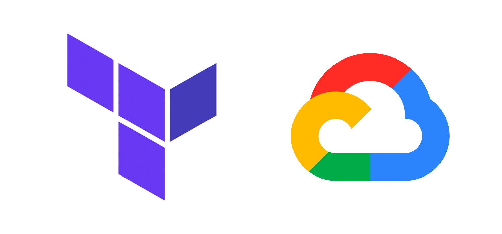

# Managing Google Cloud Run with Terraform

Medium article managing Google Cloud Run with Terraform



## Building

Export an environment variable `PORT`:

```bash
$ export PORT=8000
```

Install go dependencies:

```bash
$ go mod download
```

Build binary:

```bash
$ go build -o main .
```

### Running

If you build the code, you can run the binary:

```bash
$ ./main
```

Otherwise you can use `go run`:

```bash
$ go run server.go
```

You can access [`localhost:8000`](localhost:8000) on your browser.

## Docker

Build the image:

```bash
$ docker build . -t golang-terraform
```

Choose a `PORT`, and run the image:

```bash
$ docker run -p 8000:8000 -e PORT=8000 golang-terraform
```
